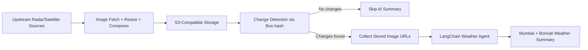
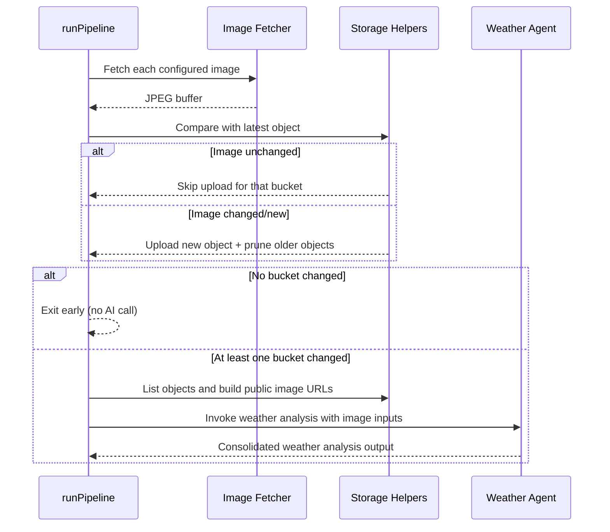

# Mausam 3.0

Mausam 3.0 is a Bun + TypeScript weather nowcasting pipeline for Mumbai MMR.
It continuously ingests radar and satellite imagery, stores snapshots in object storage,
detects meaningful image changes, and triggers an AI weather summary only when new weather signals appear.

## What This Project Does

- Fetches weather imagery from configured upstream sources (radar + satellite).
- Normalizes images to compressed JPEG for lightweight storage/analysis.
- Uploads images to S3-compatible storage (Cloudflare R2 style endpoint supported).
- Detects whether the latest frame changed from the previous one.
- Skips AI calls when all frames are unchanged.
- Invokes a LangChain agent when new weather changes are detected.

## High-Level Architecture



## Pipeline Execution Flow



## Tech Stack

- Runtime: Bun
- Language: TypeScript (ESM)
- AI Orchestration: LangChain
- Model init: `initChatModel` via LangChain
- Object storage: AWS SDK v3 (`@aws-sdk/client-s3`)
- Image processing: Sharp
- gRPC client: `@grpc/grpc-js` + `@grpc/proto-loader`

## Project Structure

```text
.
├── index.ts
├── src/
│   ├── pipeline.ts
│   ├── ai/
│   │   └── agents/
│   │       ├── model.ts
│   │       └── weather-agent.ts
│   ├── data/
│   │   └── radar/
│   │       ├── are-same.ts
│   │       └── get-image.ts
│   └── storage/
│       └── s3/
│           ├── client/
│           │   └── s3.ts
│           └── helpers/
│               ├── delete-items-in-bucket.ts
│               ├── list-buckets.ts
│               ├── list-objects.ts
│               └── upload-with-limit.ts
├── package.json
└── tsconfig.json
```

## Environment Variables

Create a `.env` file in the project root.

| Variable                | Required | Purpose                                                           |
| ----------------------- | -------- | ----------------------------------------------------------------- |
| `OPENAI_API_KEY`        | Yes      | API key used by LangChain chat model initialization.              |
| `ENDPOINT_URL`          | Yes      | S3-compatible endpoint URL (for example, R2 endpoint).            |
| `aws_access_key_id`     | Yes      | Access key for object storage.                                    |
| `aws_secret_access_key` | Yes      | Secret key for object storage.                                    |
| `R2_PUBLIC_BASE_URL`    | Yes      | Public base URL used to build accessible image URLs for AI input. |

Example:

```env
OPENAI_API_KEY=...
ENDPOINT_URL=https://<account>.r2.cloudflarestorage.com
aws_access_key_id=...
aws_secret_access_key=...
R2_PUBLIC_BASE_URL=https://<public-domain>/
```

## Setup

```bash
bun install
```

## Running

Run the weather pipeline directly:

```bash
bun src/pipeline.ts
```

The `index.ts` file is currently a simple Bun sanity entrypoint.

## gRPC Mailer Client

This project includes a ready-to-import gRPC client wrapper for `MailerService`.

- Proto file: `src/grpc/proto/sandesh.proto`
- Client wrapper: `src/grpc/client/mailer-client.ts`
- Barrel exports: `src/grpc/client/index.ts`

By default, the client connects to `localhost:50052`.
You can override this with `MAILER_GRPC_ADDRESS`.

Example:

```ts
import { sendEmailRpc, sendTelegramRpc } from "./src/grpc/client";

await sendEmailRpc({
  app_id: "mausam3.0",
  to: ["ops@example.com"],
  subject: "Weather update",
  body: "Rain risk increasing through evening.",
});

await sendTelegramRpc({
  html: "<b>ORANGE</b>: Keep umbrella ready",
});
```

## Data and Retention Behavior

- Images are resized to `800x800` and compressed as JPEG (`quality: 20`) before upload.
- Change detection compares new image bytes with the latest stored image bytes using `Bun.hash`.
- If an image has not changed, that upload is skipped.
- When new images are uploaded, older objects are pruned to keep storage bounded (approximately the most recent few per bucket).

## AI Invocation Behavior

- AI analysis runs only if at least one image stream changed in the current cycle.
- The agent receives image URLs as multimodal inputs.
- The system prompt enforces concise output with two sections:
  - Mumbai (MMR)
  - Borivali

## Operational Notes

- Ensure your object buckets already exist before running uploads.
- `R2_PUBLIC_BASE_URL` must point to publicly reachable object URLs, or AI image fetch may fail.
- If upstream image URLs fail, the pipeline throws `Image fetch failed`.
- If your S3 API keys are invalid, helper methods report `S3ServiceException` errors.

## Quick Verification Checklist

- `.env` variables set
- Buckets created and writable
- Public object URL base is correct
- `bun install` completed
- Pipeline command runs without auth/network errors

## Future Improvements

- Add automated scheduler/cron orchestration.
- Add structured logs and metrics.
- Add retries/backoff for transient upstream fetch failures.
- Add tests for change detection and retention logic.
