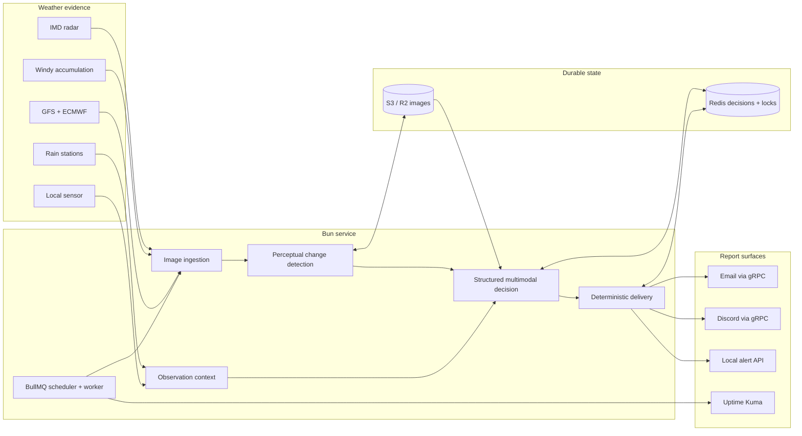
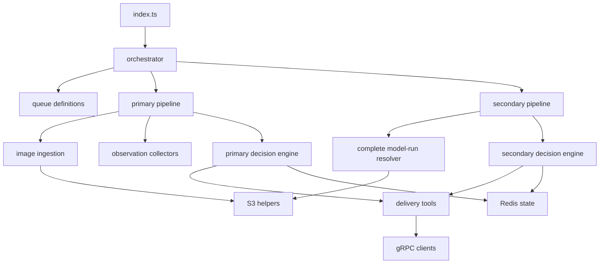
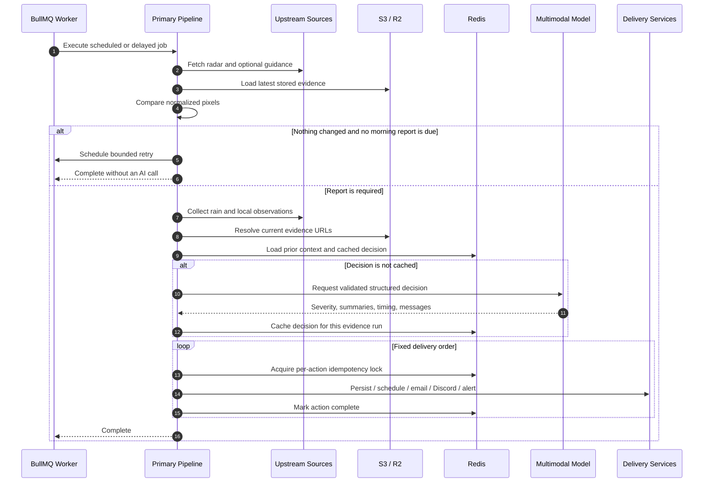
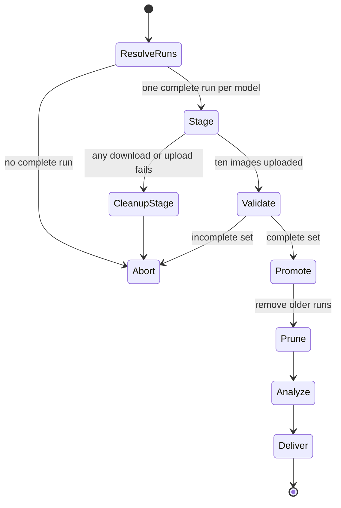
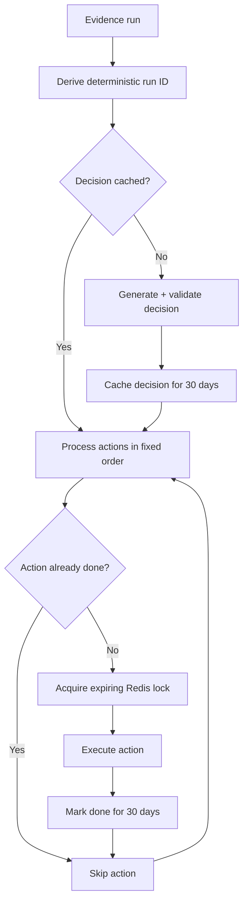

# Mausam 3.0

### Operational weather intelligence for Mumbai MMR

[](https://bun.sh)
[](https://www.typescriptlang.org/)
[](./LICENSE)

Mausam 3.0 is an automated weather-observation and reporting pipeline built for Mumbai and the Mumbai Metropolitan Region. It collects radar, rain, local-station, and numerical-model evidence; detects meaningful changes; asks a multimodal model for a constrained weather decision; and delivers a consistent report through email, Discord, and a local alert surface.

It is designed as a long-running operational service rather than a dashboard or a general-purpose weather API. The system emphasizes evidence freshness, bounded failure, deterministic delivery, and safe retries.

> [!IMPORTANT]
> Mausam is an independent decision-support project. It is not an official warning service and must not replace guidance from the India Meteorological Department, civil authorities, or emergency services.

## Contents

- [Why Mausam exists](#why-mausam-exists)
- [What it does](#what-it-does)
- [System architecture](#system-architecture)
- [How a report is produced](#how-a-report-is-produced)
- [Primary nowcast pipeline](#primary-nowcast-pipeline)
- [Secondary five-day pipeline](#secondary-five-day-pipeline)
- [Reliability model](#reliability-model)
- [Data and storage model](#data-and-storage-model)
- [Scheduling](#scheduling)
- [Project structure](#project-structure)
- [Requirements](#requirements)
- [Configuration](#configuration)
- [Installation and operation](#installation-and-operation)
- [Testing](#testing)
- [Troubleshooting](#troubleshooting)
- [Security and privacy](#security-and-privacy)
- [Contributing](#contributing)
- [License](#license)

## Why Mausam exists

Mumbai weather changes quickly and unevenly. A single city-wide forecast can miss the operational question people actually care about: what is happening now, where is the stronger signal, how might it evolve over the next few hours, and when is another update worth sending?

Mausam combines several imperfect sources instead of treating any one source as authoritative:

- Radar imagery describes current precipitation structure.
- Rain stations provide measured accumulation context.
- A local station contributes temperature, humidity, and pressure.
- GFS and ECMWF imagery provides short- and medium-range guidance.
- Previous reports provide continuity without being treated as fresh evidence.

The result is a compact reporting workflow that only runs when the evidence changes or when a scheduled morning report is due.

## What it does

- Downloads and normalizes required IMD radar images.
- Captures a rendered Windy rain-accumulation view with Puppeteer.
- Resolves complete GFS and ECMWF model runs from Tropical Tidbits.
- Stores normalized JPEG evidence in S3-compatible object storage.
- Uses perceptual comparison to ignore tiny rendering differences.
- Collects rain-station, rain-statistics, and local-station observations.
- Produces a validated structured weather decision with a multimodal model.
- Sends a layperson email, a technical Discord update, and a local alert.
- Schedules follow-up reports according to severity and Mumbai active hours.
- Uses Redis-backed decision caching and idempotency keys to make retries safe.
- Runs a separate transactional D1–D5 outlook pipeline every morning.

## System architecture


```mermaid
flowchart LR
    subgraph Sources[Weather evidence]
        IMD[IMD radar]
        WINDY[Windy accumulation]
        MODELS[GFS + ECMWF]
        RAIN[Rain stations]
        LOCAL[Local sensor]
    end

    subgraph Runtime[Bun service]
        QUEUE[BullMQ scheduler + worker]
        INGEST[Image ingestion]
        DIFF[Perceptual change detection]
        CONTEXT[Observation context]
        AI[Structured multimodal decision]
        DELIVERY[Deterministic delivery]
    end

    subgraph State[Durable state]
        S3[(S3 / R2 images)]
        REDIS[(Redis decisions + locks)]
    end

    subgraph Outputs[Report surfaces]
        MAIL[Email via gRPC]
        DISCORD[Discord via gRPC]
        ALERT[Local alert API]
        MONITOR[Uptime Kuma]
    end

    IMD --> INGEST
    WINDY --> INGEST
    MODELS --> INGEST
    INGEST --> DIFF
    DIFF <--> S3
    RAIN --> CONTEXT
    LOCAL --> CONTEXT
    QUEUE --> INGEST
    DIFF --> AI
    CONTEXT --> AI
    S3 --> AI
    AI <--> REDIS
    AI --> DELIVERY
    DELIVERY <--> REDIS
    DELIVERY --> MAIL
    DELIVERY --> DISCORD
    DELIVERY --> ALERT
    QUEUE --> MONITOR
```

### Component dependency graph


```mermaid
graph TD
    ENTRY[index.ts] --> ORCH[orchestrator]
    ORCH --> QUEUE[queue definitions]
    ORCH --> PRIMARY[primary pipeline]
    ORCH --> SECONDARY[secondary pipeline]
    PRIMARY --> INGEST[image ingestion]
    PRIMARY --> OBS[observation collectors]
    PRIMARY --> PAGENT[primary decision engine]
    SECONDARY --> RUNS[complete model-run resolver]
    SECONDARY --> SAGENT[secondary decision engine]
    PAGENT --> TOOLS[delivery tools]
    SAGENT --> TOOLS
    TOOLS --> GRPC[gRPC clients]
    INGEST --> STORAGE[S3 helpers]
    RUNS --> STORAGE
    PAGENT --> REDIS[Redis state]
    SAGENT --> REDIS
```

Queue construction is deliberately separated from orchestration startup. Importing a pipeline or scheduling helper does not start a worker, create schedules, or delete queued work.

## How a report is produced


```mermaid
sequenceDiagram
    autonumber
    participant Q as BullMQ Worker
    participant P as Primary Pipeline
    participant U as Upstream Sources
    participant S as S3 / R2
    participant R as Redis
    participant M as Multimodal Model
    participant D as Delivery Services

    Q->>P: Execute scheduled or delayed job
    P->>U: Fetch radar and optional guidance
    P->>S: Load latest stored evidence
    P->>P: Compare normalized pixels

    alt Nothing changed and no morning report is due
        P->>Q: Schedule bounded retry
        P-->>Q: Complete without an AI call
    else Report is required
        P->>U: Collect rain and local observations
        P->>S: Resolve current evidence URLs
        P->>R: Load prior context and cached decision
        alt Decision is not cached
            P->>M: Request validated structured decision
            M-->>P: Severity, summaries, timing, messages
            P->>R: Cache decision for this evidence run
        end
        loop Fixed delivery order
            P->>R: Acquire per-action idempotency lock
            P->>D: Persist / schedule / email / Discord / alert
            P->>R: Mark action complete
        end
        P-->>Q: Complete
    end
```

The model proposes one structured decision. Application code—not the model—controls side-effect order, scheduling bounds, recipients, and retry behavior.

## Primary nowcast pipeline

The primary pipeline focuses on current conditions and the next several hours.

### Evidence priority

The reporting prompt and execution flow use the following hierarchy:

1. Radar and measured observations
2. Local rain and station context
3. Short-range GFS/ECMWF guidance
4. Previous report memory
5. Medium-range outlook memory

Previous state improves continuity but is never considered current ground truth.

### Image ingestion

Required radar sources fail the run when unavailable. Windy and short-range model sources are optional: their failure is logged, and the most recently stored image may still be used.

Direct images retain the established normalization behavior:

- Resize: `800 × 800`
- Fit: `cover`, centered
- Format: JPEG
- Quality: `20`

Windy screenshots use a `1280 × 720` viewport and JPEG quality `80` so the map, legend, timeline, city labels, and controls remain visible.

### Change detection

The latest and incoming images are normalized to a small grayscale comparison surface. A frame is treated as unchanged when both its average pixel difference and materially changed pixel fraction remain below conservative thresholds. This avoids reports caused only by JPEG noise, antialiasing, or tiny page-render differences.

The original image is still stored and supplied to the model; the comparison surface is used only for change detection.

### Morning report

Between 07:00 and 07:30 IST, Redis tracks one morning report per Mumbai calendar date. The pipeline no longer wipes evidence buckets to force the report. The marker is written only after the report completes successfully.

## Secondary five-day pipeline

The secondary pipeline creates a D1–D5 outlook from GFS and ECMWF frames at approximately +24, +48, +72, +96, and +120 hours.


```mermaid
stateDiagram-v2
    [*] --> ResolveRuns
    ResolveRuns --> Abort: no complete run
    ResolveRuns --> Stage: one complete run per model
    Stage --> CleanupStage: any download or upload fails
    CleanupStage --> Abort
    Stage --> Validate: ten images uploaded
    Validate --> Abort: incomplete set
    Validate --> Promote: complete set
    Promote --> Prune: remove older runs
    Prune --> Analyze
    Analyze --> Deliver
    Deliver --> [*]
```

Each model is resolved to one initialization run that contains every required frame. Frames from different model initializations are never silently mixed.

Images are uploaded under a deterministic run prefix. Existing complete evidence is retained until all ten new images have uploaded. If staging fails, only the staged objects are removed. The model is never called with an incomplete set.

## Reliability model

### Structured decisions

Primary and secondary model outputs are parsed with Zod. Free-form model text does not directly trigger external actions. A primary decision contains:

- One severity: green, yellow, orange, or red
- Compact radar and forecast memory
- Optional follow-up delay
- Email subject and HTML body
- Discord body
- Alert-banner text

The secondary decision contains one severity, compact D1–D5 memory, email content, and technical Discord content.

### Retry-safe delivery


```mermaid
flowchart TD
    START[Evidence run] --> KEY[Derive deterministic run ID]
    KEY --> CACHE{Decision cached?}
    CACHE -->|No| MODEL[Generate + validate decision]
    MODEL --> SAVE[Cache decision for 30 days]
    CACHE -->|Yes| ACTIONS
    SAVE --> ACTIONS[Process actions in fixed order]
    ACTIONS --> DONE{Action already done?}
    DONE -->|Yes| NEXT[Skip action]
    DONE -->|No| LOCK[Acquire expiring Redis lock]
    LOCK --> EXECUTE[Execute action]
    EXECUTE --> MARK[Mark done for 30 days]
    MARK --> NEXT
    NEXT --> ACTIONS
```

The decision and each delivery action use the same evidence-derived run ID. If a job fails after email but before Discord, a retry reuses the exact decision, skips the completed email action, and resumes at Discord.

Locks expire after ten minutes so a crashed worker cannot block a run forever. Failed actions release their lock immediately.

### Bounded I/O

- Image fetches: 30-second deadline
- Model availability probes: 15-second deadline
- Rain and local APIs: 10-second deadline
- gRPC delivery calls: 15-second deadline
- AI decision generation: 120-second deadline
- Uptime Kuma pushes: 10-second deadline
- Rain-statistics scraping: three attempts with a 30-second request timeout

### Failure behavior

| Failure | Behavior |
| --- | --- |
| Required radar unavailable | Fail job and schedule a primary retry during active hours |
| Optional image unavailable | Continue with stored evidence when available |
| S3 list failure | Fail explicitly; never treat it as an empty bucket |
| Replacement upload failure | Preserve the previous object |
| Partial S3 deletion | Fail with the per-object deletion error count |
| Incomplete secondary image set | Remove staged images and do not generate a report |
| Invalid external JSON | Reject the payload through runtime validation |
| Email/Discord reports `success: false` | Fail that delivery action and retry safely |
| Alert API reports `ok: false` | Fail the alert action and retry safely |
| Redis unavailable | Fail rather than perform non-idempotent delivery |
| Uptime push unavailable | Log the monitoring failure without repeating a successful report |

## Data and storage model

### Object-storage buckets

The configured image sources currently use:

| Bucket | Content | Required |
| --- | --- | --- |
| `radar-ppi-z` | IMD PPI-Z radar | Yes |
| `radar-sri` | IMD surface-rainfall-intensity image | Yes |
| `satellite` | Windy rain-accumulation screenshot | No |
| `gfs` | Short-range GFS image | No |
| `ecmwf` | Short-range ECMWF image | No |
| `model-images` | Transactional D1–D5 GFS/ECMWF sets | Secondary pipeline |

Primary buckets keep the latest successfully uploaded evidence. The replacement is uploaded first and the previous object is deleted only after upload success.

### Redis keys

| Key or prefix | Purpose |
| --- | --- |
| `latest_prev_status` | Compact primary weather memory |
| `secondary_prev_status` | Compact D1–D5 outlook memory |
| `latest_alert_banner` | Most recently delivered alert banner |
| `mausam:morning-report:<date>` | Once-per-date morning completion marker |
| `mausam:decision:<run-id>` | Validated decision cache |
| `mausam:delivery:<run-id>:<action>` | Delivery lock and completion marker |

Decision and delivery keys expire after 30 days. Active delivery locks expire after ten minutes.

## Scheduling

BullMQ uses Redis at `127.0.0.1:6379` by default.

| Job | Schedule | Time zone | Purpose |
| --- | --- | --- | --- |
| Primary pipeline | `15 7 * * *` | Asia/Kolkata | Daily morning nowcast |
| Secondary pipeline | `0 7 * * *` | Asia/Kolkata | Daily D1–D5 outlook |
| Uptime heartbeat | `* * * * *` | Host cron cadence | Worker health signal |
| Startup pipeline | Once per 30-minute startup window | — | Fresh report after service startup |
| Delayed retry | Severity/failure dependent | Asia/Kolkata | Same-day follow-up |

Delayed jobs are accepted only when their target remains on the same Mumbai calendar day and falls between 07:00 inclusive and 23:00 exclusive. Job IDs are derived from the target minute to suppress duplicates.

On startup, the service removes only schedules created by the legacy repeat-job implementation and then idempotently upserts the current schedulers. It does not obliterate the queue or remove delayed work.

## Project structure

```text
.
├── index.ts                         # Service entrypoint
├── launchd/                         # macOS service definition
├── src/
│   ├── config.ts                    # Runtime configuration validation
│   ├── pipeline.ts                  # Primary nowcast orchestration
│   ├── secondaryPipeline.ts         # Transactional D1-D5 orchestration
│   ├── ai/
│   │   ├── agents/                  # Structured decision generation
│   │   ├── decision-cache.ts        # Stable decisions across retries
│   │   ├── delivery-idempotency.ts  # Per-channel exactly-once guard
│   │   └── tools/                   # Email, Discord, alert, and state actions
│   ├── bull/
│   │   ├── active-hours.ts          # Mumbai scheduling policy
│   │   ├── queue.ts                 # Side-effect-free queue definitions
│   │   ├── scheduleJobs.ts          # Deduplicated delayed jobs
│   │   └── orchestrator.ts          # Schedulers, worker, shutdown
│   ├── data/                         # Radar, Windy, rain, and local inputs
│   ├── grpc/                         # Mailer and Discord clients/protos
│   ├── pipeline/helpers/             # Ingestion and saved-image assembly
│   ├── scrape/                       # Rain-statistics scraper
│   └── storage/s3/                   # S3 client, upload, list, and delete logic
├── .env.example                     # Configuration template
├── package.json
├── tsconfig.json
└── LICENSE                          # GNU AGPL v3 or later
```

Tests live beside the modules they exercise and use Bun's built-in test runner.

## Requirements

- macOS or Linux
- [Bun](https://bun.sh/) 1.3 or newer
- Redis 6 or newer
- S3-compatible object storage and the buckets listed above
- An OpenAI-compatible model available through LangChain
- Chromium installed through Puppeteer's managed browser setup
- A compatible Mailer gRPC service
- A compatible Discord Webhook gRPC service
- Optional local weather and alert HTTP services

The included launchd configuration assumes Apple Silicon Homebrew Bun at `/opt/homebrew/bin/bun` and the repository at `/Users/aneeshpatne/code/mausam3.0`. Adjust those paths for another machine.

## Configuration

Copy the template and fill every required value:

```bash
cp .env.example .env
```

Bun loads `.env` automatically.

### Required variables

| Variable | Description |
| --- | --- |
| `OPENAI_API_KEY` | Model-provider credential used by LangChain |
| `ENDPOINT_URL` | S3-compatible API endpoint |
| `aws_access_key_id` | S3 access-key ID |
| `aws_secret_access_key` | S3 secret access key |
| `R2_PUBLIC_BASE_URL` | Public base URL from which the model can read images |
| `MAIL_RECIPIENTS` | Comma-separated email recipients |
| `LOCAL_WEATHER_URL` | Local-station JSON endpoint |
| `LOCAL_ALERT_URL` | Local alert-controller endpoint |
| `RAIN_STATS_URL` | HTML page used by the rain-statistics scraper |
| `UPTIME_KUMA_PUSH_URL` | Minute heartbeat push URL |
| `AI_JOB_PUSH_URL` | Successful primary-run push URL |

### Optional variables

| Variable | Default | Description |
| --- | --- | --- |
| `REDIS_HOST` | `127.0.0.1` | BullMQ Redis host |
| `REDIS_PORT` | `6379` | BullMQ Redis port |
| `MAILER_GRPC_ADDRESS` | `localhost:50055` | Mailer service address |
| `DISCORD_WEBHOOK_GRPC_ADDRESS` | `localhost:50051` | Discord service address |
| `DISCORD_CHANNEL_NAME` | `weather` | Destination channel alias |

Configuration is validated before schedulers or workers start. Errors identify the missing or invalid variable but never log its value.

## Installation and operation

### Install dependencies

```bash
bun install
```

### Verify dependencies

Before starting Mausam, ensure Redis and the two gRPC services are reachable and that every S3 bucket exists.

### Start the service

```bash
bun start
```

This starts the scheduler and worker, installs or updates repeat schedules, and enqueues one deduplicated startup run.

### Run under launchd

The repository includes `launchd/com.mausam3.orchestrator.plist`. After adjusting paths and environment-specific values, install it under `~/Library/LaunchAgents/` and load it with `launchctl`.

The service handles `SIGTERM` and `SIGINT` by closing the BullMQ worker and queue, gRPC clients, S3 client, and Redis client.

### Stop foreground execution

Press `Ctrl-C`. Active work is allowed to close through the graceful-shutdown path.

## Testing

Run the complete suite:

```bash
bun test
```

Run strict TypeScript validation:

```bash
bun run typecheck
```

Run coverage:

```bash
bun test --coverage
```

The suite covers URL/run selection, Mumbai active hours, source routing, optional-source behavior, saved-image assembly, decision caching, delivery idempotency, email sanitization, perceptual image comparison, storage replacement ordering, and Puppeteer cleanup.

## Troubleshooting

### The service exits during startup

Read the named configuration error and compare `.env` with `.env.example`. Startup validation intentionally stops before queue initialization when required configuration is missing.

### Redis connection is refused

Confirm Redis is running and check `REDIS_HOST` and `REDIS_PORT`:

```bash
redis-cli PING
```

Expected response: `PONG`.

### The pipeline repeatedly reports missing required images

Check upstream IMD reachability, S3 credentials, bucket existence, and `R2_PUBLIC_BASE_URL`. Required radar failure aborts the run; optional Windy or model failure does not.

### Model images upload but analysis fails

The public image URLs must be reachable by the model provider. S3 API access alone is insufficient. Verify the generated public URL without exposing credentials.

### Secondary reports never send

The secondary pipeline requires one complete GFS run and one complete ECMWF run with all five frames. During publication, it may defer until the next retry rather than mix model initializations.

### Email or Discord keeps retrying

Check the corresponding gRPC service. Successful channels are marked complete and will not be resent; only the incomplete action resumes.

### Puppeteer cannot launch Chromium

Install Puppeteer's managed browser and confirm the service account can execute it. On a headless host, verify compatible system libraries are present.

## Security and privacy

- Never commit `.env`, access keys, recipient lists, monitor tokens, or private endpoints.
- Rotate any credential that appears in logs, shell history, or source control.
- Keep Redis and the gRPC services bound to trusted interfaces unless transport security and authentication are configured.
- The bundled gRPC defaults use insecure local channels and are appropriate only for trusted local networking.
- Email HTML is sanitized for scripts, event handlers, and executable URL schemes before delivery.
- Image URLs supplied to the model are public by design; do not store private imagery in these buckets.
- Model output is untrusted data. Zod validation and application-controlled side effects form the enforcement boundary.
- Review upstream-source terms before redistributing imagery.

## Contributing

Contributions should preserve the project's core invariants:

1. Do not introduce side effects at module-import time.
2. Never delete the only complete evidence set before replacement succeeds.
3. Keep model output structured and external actions application-controlled.
4. Make every retryable outward action idempotent.
5. Add bounded timeouts to all external I/O.
6. Use Mumbai time explicitly for product scheduling rules.
7. Use Bun commands and `bun:test` throughout the repository.
8. Add or update tests with every behavioral change.

Before opening a change, run:

```bash
bun test
bun run typecheck
git diff --check
```

## License

Mausam 3.0 is licensed under the **GNU Affero General Public License, version 3 or any later version** (`AGPL-3.0-or-later`). See [LICENSE](./LICENSE).

The AGPL is a strong copyleft license. In practical terms, if you distribute a modified version, or operate a modified version for users over a network, you must make the corresponding source available under the same license, subject to the complete license terms—especially section 13 for remote network interaction.

This README is a plain-language project description, not legal advice. The complete license terms control.

Copyright © 2026 Mausam contributors.
