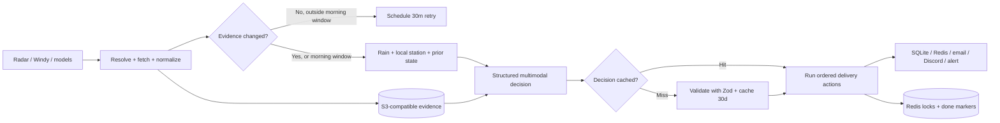
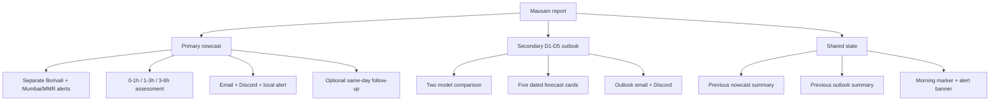
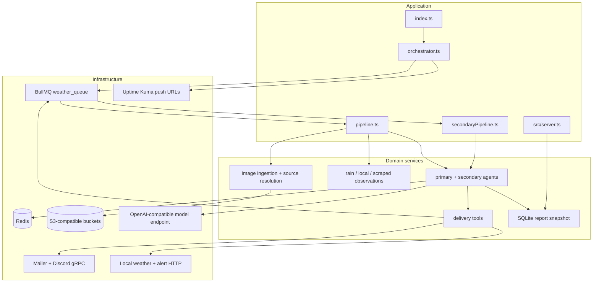

<div align="center">

# Mausam 3.0

**Weather updates for Mumbai that only fire when the evidence changes**

Mausam turns radar, station observations, and forecast-model imagery into a near-term nowcast and a five-day Mumbai Metropolitan Region outlook, then delivers the result through email, Discord, a local alert endpoint, and a static web surface.

[](https://bun.sh)
[](https://www.typescriptlang.org/)
[](https://docs.bullmq.io/)
[](#observed-production-snapshot)
[](#running-tests)
[](./LICENSE)

[Repository](https://github.com/aneeshpatne/mausam3.0) · [Web app source](./src/apps/web/) · [Architecture](#architecture) · [Getting started](#getting-started)

</div>

---

## Overview

Mausam receives five primary evidence streams: IMD PPI-Z and SRI radar frames, a Windy rain-accumulation screenshot, and short-range GFS and ECMWF model frames. It combines those images with rain observations from Borivali and Kandivali East, scraped rain statistics, a local station feed, and prior report state. The user receives a structured severity decision for Borivali and Mumbai/MMR, a five-day outlook, concise email and Discord reports, and a short local alert banner.

The implementation is a long-running [Bun](https://bun.sh) process backed by [BullMQ](https://docs.bullmq.io/) and Redis. [Sharp](https://sharp.pixelplumbing.com/) normalizes direct images, [Puppeteer](https://pptr.dev/) captures rendered map pages, and LangChain models return [Zod](https://zod.dev/)-validated objects. Application code owns persistence, scheduling, delivery order, retries, and idempotency; free-form model text never drives side effects.

> [!IMPORTANT]
> Mausam is an independent decision-support project. It is not an official warning service and must not replace guidance from the India Meteorological Department, civil authorities, or emergency services.

## Product preview

The repository includes a static [Astro](https://astro.build/) web surface that renders the latest persisted nowcast, five-day outlook, report history, model reasoning, and source summaries. It also progressively registers three read-only WebMCP tools when the browser exposes `document.modelContext`:

- `get_weather_nowcast`
- `get_weather_outlook`
- `get_forecast_reasoning`

Browsers without WebMCP still receive the same rendered page. The web app is configured as a static asset deployment for [Cloudflare Workers](https://developers.cloudflare.com/workers/); no hosted demo URL is committed to the repository.

## Why this project

Scheduled weather reporting can create noise when the underlying evidence has not changed. Mausam makes report generation conditional on changed image bytes, while preserving a morning report window and scheduling a later follow-up only when the severity decision says it is useful.

The problem is split into two concerns: detect whether new evidence exists, then produce and deliver a bounded, comparable decision when it does.

## Engineering outcomes

| Outcome | Result |
| --- | --- |
| Fewer redundant model calls | Exact byte comparison skips ingestion-driven AI analysis when the latest evidence is unchanged; a 07:00–07:30 IST morning window can still force one report for the Mumbai calendar date. |
| Lower multimodal input cost | Direct frames are resized to 800×800 JPEG quality 20, primary analysis retains at most two frames per source, and unchanged imagery bypasses inference. The project estimates a reduction from roughly ~50k to ~7.5k image tokens for the compared high-count and resized-primary cases—about 85%. |
| Safer retries | A validated decision is cached for 30 days by evidence-derived run ID; each delivery action gets a 10-minute lock and a 30-day completion marker. Retried jobs can resume without repeating completed side effects. |
| Partial-source tolerance | Required radar failures abort a primary run. Optional Windy, GFS, and ECMWF failures continue with the latest stored object when available; rain-station and rain-statistics failures are logged and omitted from the prompt. |
| Complete forecast staging | Secondary analysis resolves a complete two-model, five-horizon image set before inference. Partially staged images are removed on failure, and older staged keys are removed only after the new set is complete. |
| Operational record | A dated production snapshot records 392 reports across 63 monsoon days: 343 primary nowcasts and 49 secondary outlooks. |

## Features

| Area | What the project provides |
| --- | --- |
| **Primary nowcast** | Assesses Borivali and Mumbai/MMR separately across now–1h, 1–3h, and 3–6h windows using current radar, observations, and short-range model guidance. |
| **Secondary D1–D5 outlook** | Compares GFS and ECMWF across +24h, +48h, +72h, +96h, and +120h, with one dated forecast card per horizon. |
| **Evidence ingestion** | Reads required PPI-Z/SRI radar plus optional Windy accumulation, GFS, and ECMWF imagery. Direct images become 800×800 JPEGs; rendered pages use a 1280×720 Puppeteer viewport and JPEG quality 80. |
| **Change-gated execution** | Stores the newest evidence in S3-compatible buckets, compares it with the previous object, and only proceeds to analysis when bytes change or the morning guarantee applies. |
| **Structured decisions** | Uses one Zod-validated structured model invocation per analyzed run. Output contains alert levels, compact state memory, website data, email HTML, Discord text, and alert-banner text. |
| **Multi-channel delivery** | Primary delivery order is status → website snapshot → optional follow-up → email → Discord → local alert. Secondary delivery order is status → website snapshot → email → Discord. |
| **Severity-aware timing** | Validates follow-up delays in code: red 2–3h, orange 3–6h, yellow 3–10h, green 8–12h, or no same-day follow-up. Delayed primary jobs coalesce under one BullMQ deduplication ID. |
| **State and persistence** | Redis holds queue state, compact prior summaries, decision cache entries, delivery locks, completion markers, and the morning marker. SQLite stores build-ready nowcast and outlook reports for the web app. |
| **WebMCP read access** | The Astro client exposes focused, empty-input, read-only tools for the nowcast, five-day outlook, and detailed forecast reasoning when WebMCP is available. |
| **Health signals** | A BullMQ scheduler sends an Uptime Kuma heartbeat every minute and a second push after successful primary analysis. |

> [!NOTE]
> **Implementation status**
>
> - **Complete:** primary and secondary pipelines, optional-source tolerance, decision caching, delivery idempotency, BullMQ schedules, SQLite web snapshots, WebMCP registration, and the launchd unit.
> - **Operational dependencies:** the orchestrator needs Redis, S3-compatible storage, an OpenAI-compatible model endpoint, the local weather and alert HTTP services, rain-statistics HTML, Uptime Kuma push URLs, and the mailer/Discord gRPC services for those delivery channels.
> - **Known startup behavior:** `startOrchestrator()` obliterates `weather_queue` on startup before reinstalling schedulers and enqueuing a startup run. Delayed work from a prior process lifetime is not preserved across restarts.
> - **Coverage:** rain context currently uses two configured gauges—Borivali and Kandivali East—plus scraped rain statistics.

## From input to result


```mermaid
flowchart LR
  SRC[Radar / Windy / models] --> ING[Resolve + fetch + normalize]
  ING --> CMP{Evidence changed?}
  CMP -->|No, outside morning window| RETRY[Schedule 30m retry]
  CMP -->|Yes, or morning window| CTX[Rain + local station + prior state]
  CTX --> AI[Structured multimodal decision]
  AI --> CACHE{Decision cached?}
  CACHE -->|Miss| VALIDATE[Validate with Zod + cache 30d]
  CACHE -->|Hit| DELIVER
  VALIDATE --> DELIVER[Run ordered delivery actions]
  DELIVER --> OUT[SQLite / Redis / email / Discord / alert]
  ING --> STORE[(S3-compatible evidence)]
  STORE --> AI
  DELIVER --> LOCKS[(Redis locks + done markers)]
```

The primary path retains the two newest objects per source and labels them with capture times. Required radar failures are fatal; optional source failures degrade independently. Failed jobs request a 30-minute retry when the Mumbai active-hours guard permits it. A run ID derived from mode and public image URLs makes the decision cache stable across retries.

## Report domains


```mermaid
graph TD
  REPORT[Mausam report]
  REPORT --> NOW[Primary nowcast]
  REPORT --> OUTLOOK[Secondary D1-D5 outlook]
  REPORT --> STATE[Shared state]

  NOW --> N1[Separate Borivali + Mumbai/MMR alerts]
  NOW --> N2[0-1h / 1-3h / 3-6h assessment]
  NOW --> N3[Email + Discord + local alert]
  NOW --> N4[Optional same-day follow-up]

  OUTLOOK --> O1[Two model comparison]
  OUTLOOK --> O2[Five dated forecast cards]
  OUTLOOK --> O3[Outlook email + Discord]

  STATE --> S1[Previous nowcast summary]
  STATE --> S2[Previous outlook summary]
  STATE --> S3[Morning marker + alert banner]
```

## Architecture


```mermaid
flowchart TB
  subgraph App[Application]
    ENTRY[index.ts]
    ORCH[orchestrator.ts]
    PRIMARY[pipeline.ts]
    SECONDARY[secondaryPipeline.ts]
    API[src/server.ts]
  end

  subgraph Domain[Domain services]
    INGEST[image ingestion + source resolution]
    OBS[rain / local / scraped observations]
    AGENTS[primary + secondary agents]
    DELIVERY[delivery tools]
    SITE[SQLite report snapshot]
  end

  subgraph Infra[Infrastructure]
    QUEUE[BullMQ weather_queue]
    REDIS[(Redis)]
    OBJECTS[(S3-compatible buckets)]
    MODEL[OpenAI-compatible model endpoint]
    RPC[Mailer + Discord gRPC]
    LOCAL[Local weather + alert HTTP]
    MONITOR[Uptime Kuma push URLs]
  end

  ENTRY --> ORCH
  ORCH --> QUEUE
  ORCH --> MONITOR
  QUEUE --> PRIMARY
  QUEUE --> SECONDARY
  PRIMARY --> INGEST
  PRIMARY --> OBS
  PRIMARY --> AGENTS
  SECONDARY --> AGENTS
  INGEST --> OBJECTS
  AGENTS --> MODEL
  AGENTS --> DELIVERY
  AGENTS --> SITE
  AGENTS --> REDIS
  DELIVERY --> RPC
  DELIVERY --> LOCAL
  DELIVERY --> QUEUE
  API --> SITE
```

The code keeps the queue definition side-effect-free: `src/bull/queue.ts` constructs the BullMQ queue, while workers, schedulers, queue obliteration, and shutdown live in `orchestrator.ts`. The two pipelines share infrastructure but keep their evidence sets and report schemas separate.

The agents propose validated data. Application tools perform side effects in a fixed sequence through `runDeliveryOnce`. Evidence-derived run IDs, Redis decision caching, per-action locks, and completion markers make retries resumable. S3 replacement uses upload-then-delete ordering so an upload failure does not remove the previous evidence. Mumbai scheduling and timestamps use explicit `Asia/Kolkata` helpers.

## Engineering decisions

| Decision | Reason | Trade-off |
| --- | --- | --- |
| **Change gating by exact bytes** | Avoids model calls and downstream notifications for identical evidence. | Encoding changes can count as new evidence even when the visual scene is effectively unchanged; perceptual comparison is not used. |
| **One structured model call per run** | Keeps the model responsible for interpretation while application code owns side effects and delivery order. | The model does not independently retry or coordinate delivery; orchestration remains in application code. |
| **Redis decision cache plus action idempotency** | A retry can reuse a validated decision and skip actions already marked complete. | Redis state and TTLs are part of delivery correctness. |
| **Atomic secondary staging** | Prevents analysis of an incomplete GFS/ECMWF D1–D5 set. | A single missing or unavailable frame aborts that secondary run after cleanup. |
| **Separate Borivali and Mumbai/MMR severities** | Keeps local notifications from inheriting a regional alert without supporting evidence. | Every channel and persistence path must choose the appropriate assessment explicitly. |
| **Explicit Mumbai-time scheduling** | Keeps active-hours checks, morning guarantees, and recurring schedules aligned to the product location. | Time-zone handling is an application concern rather than a host default. |

## Tech stack

| Layer | Technology |
| --- | --- |
| Runtime / language | [Bun](https://bun.sh), TypeScript |
| Job orchestration | [BullMQ](https://docs.bullmq.io/) on Redis |
| AI / structured output | [LangChain](https://js.langchain.com/), @langchain/openai, Zod |
| Configured models | gpt-5.6-sol for primary analysis and gpt-5.6-terra for secondary analysis |
| Image processing | [Sharp](https://sharp.pixelplumbing.com/) |
| Browser capture | [Puppeteer](https://pptr.dev/) |
| Forecast sources | IMD radar, Windy, Tropical Tidbits GFS, Tropical Tidbits ECMWF |
| Object storage | AWS SDK S3 client against S3-compatible endpoints |
| Persistence | bun:sqlite for report snapshots; Redis for transient and idempotency state |
| Delivery | gRPC via @grpc/grpc-js and protobuf definitions |
| Web app | Astro, React, lucide-react, WebMCP types |
| Testing | bun:test, Astro check |
| Host process | macOS launchd unit in launchd/ |

## Performance, scale, and reliability

The implementation includes the following concrete bounds and operating characteristics.

| Dimension | Result |
| --- | --- |
| Primary evidence | 5 configured image sources: 2 required radar feeds and 3 optional sources. |
| Storage layout | 6 S3-compatible buckets: radar-ppi-z, radar-sri, satellite, gfs, ecmwf, and model-images. |
| Image input | Primary direct frames are 800×800 JPEG quality 20; Windy screenshots are 1280×720 JPEG quality 80. |
| Primary frame count | At most 2 retained objects per source, up to 10 frames in one primary model call. |
| Secondary frame count | 10 images per analyzed run: 2 models × 5 horizons from +24h through +120h. |
| Inference shape | 1 structured decision invocation per analyzed run; unchanged primary evidence skips inference except during the morning guarantee. |
| Prompt / output limits | 24h prompt-cache keys; reasoningEffort low; Discord messages ≤900 characters; email subjects ≤80 characters; alert banners ≤7 words. |
| Decision reuse | Redis decision cache TTL of 30 days; delivery locks last 10 minutes; completion markers last 30 days. |
| Scheduling | 3 recurring BullMQ schedules: secondary at 07:00 IST, primary at 07:15 IST, and a one-minute heartbeat. |
| Failure handling | Required radar failure aborts the primary run; optional image and station failures degrade independently; failed jobs request a 30-minute retry when allowed. |
| Evidence retention | Primary ingestion retains the 2 latest objects per source; replacement uploads before deleting older history. |
| Local validation | `bun test`: 57 passing tests across 21 files. `bun run typecheck` passes. Latest local coverage report: 76.62% lines and 75.04% functions. |

### Observed production snapshot

The repository records the following historical operational snapshot for **24 Jun 2026 through 25 Aug 2026**. Queue and status values were captured on **25 Aug 2026 at approximately 17:36 IST**.

| Metric | Value |
| --- | --- |
| Days in production this monsoon | **63** |
| Reports delivered | **392** — 343 primary nowcasts and 49 secondary outlooks |
| Emails sent | **390** to 2 recipients |
| Discord messages | **390** |
| Local alerts | **336** |
| Follow-ups scheduled | **272** |
| Severity mix | yellow 297 · orange 89 · green 6 · red 0 |
| Average cadence | **6.2 reports/day** |
| Queue snapshot | waiting 0 · active 0 · delayed 4 · completed 10 · failed 32 · schedulers 3 |
| Process start at capture | 21 Aug 2026, 11:17 IST |

## Current limitations

- The orchestrator intentionally clears `weather_queue` on startup, so delayed jobs from before a restart are not preserved.
- Email and Discord delivery depend on separately running gRPC services.
- The web app is a build-time SQLite snapshot; the build must run after new reports are persisted.
- The included launchd unit assumes Apple Silicon Homebrew Bun and the checked-in absolute working directory; edit it for another host.
- There is no committed CI workflow or load-test harness.

## Project structure

```text
.
├── index.ts                              # Orchestrator entrypoint
├── launchd/
│   └── com.mausam3.orchestrator.plist   # macOS KeepAlive service definition
├── src/
│   ├── config.ts                         # Required environment validation
│   ├── pipeline.ts                       # Primary nowcast pipeline
│   ├── secondaryPipeline.ts              # Transactional D1-D5 pipeline
│   ├── server.ts                         # Health and SQLite snapshot API
│   ├── ai/
│   │   ├── agents/                       # Prompts, models, agent schemas
│   │   ├── decision-cache.ts             # Redis decision cache
│   │   ├── delivery-idempotency.ts       # Per-action locks and markers
│   │   └── tools/                        # Delivery and persistence tools
│   ├── bull/                             # Queue, worker, schedules, time policy
│   ├── data/                             # Radar, model, Windy, rain, station inputs
│   ├── pipeline/helpers/                 # Evidence collection and staging
│   ├── scrape/rainStats/                 # Rain-statistics HTML parser
│   ├── grpc/                             # Mailer and Discord protobuf clients
│   ├── storage/s3/                       # S3 client and object helpers
│   └── storage/weather-db.ts             # SQLite report persistence
├── src/apps/web/
│   ├── src/pages/index.astro             # Static web entrypoint
│   ├── src/main.tsx                      # React interface
│   ├── src/webmcp.ts                     # Read-only WebMCP tools
│   ├── scripts/sync-site-data.ts         # SQLite → build snapshot
│   └── wrangler.jsonc                    # Static asset deployment config
├── .env.example                          # Environment template
├── package.json
├── tsconfig.json
└── LICENSE
```

Tests live beside the modules they exercise.

## Requirements

For the orchestrator:

- [Bun](https://bun.sh/)
- Redis reachable at REDIS_HOST / REDIS_PORT (127.0.0.1:6379 by default)
- S3-compatible object storage with the six buckets named above
- An OpenAI-compatible model endpoint and OPENAI_API_KEY
- Chromium available through Puppeteer
- Mailer and Discord webhook gRPC services for those channels
- Reachable HTTP endpoints for local weather, local alerts, rain statistics, and Uptime Kuma
- Outbound access to IMD radar, Windy, Tropical Tidbits, and the configured rain endpoints

For the web app:

- Bun
- The SQLite database populated at data/mausam.sqlite before a production build
- Wrangler authentication if deploying with the included deploy script

## Getting started

### Orchestrator

1. Clone the repository and enter it:

```bash
git clone https://github.com/aneeshpatne/mausam3.0.git
cd mausam3.0
```

2. Install root dependencies:

```bash
bun install
```

3. Create the environment file:

```bash
cp .env.example .env
```

Configure every required value. Bun loads .env automatically.

| Variable | Purpose |
| --- | --- |
| OPENAI_API_KEY | Model provider credential |
| ENDPOINT_URL | S3-compatible API endpoint |
| aws_access_key_id / aws_secret_access_key | Object-storage credentials |
| R2_PUBLIC_BASE_URL | Public base URL used to expose stored images to the model |
| MAIL_RECIPIENTS | Comma-separated email recipients |
| LOCAL_WEATHER_URL | Local-station JSON endpoint |
| LOCAL_ALERT_URL | Local alert controller endpoint |
| RAIN_STATS_URL | Rain-statistics HTML page |
| UPTIME_KUMA_PUSH_URL | Minute heartbeat push URL |
| AI_JOB_PUSH_URL | Successful primary-run push URL |
| REDIS_HOST / REDIS_PORT | Optional Redis host and port; defaults to 127.0.0.1:6379 |
| MAILER_GRPC_ADDRESS | Optional mailer address; defaults to localhost:50055 |
| DISCORD_WEBHOOK_GRPC_ADDRESS | Optional Discord service address; defaults to localhost:50051 |
| DISCORD_CHANNEL_NAME | Optional channel name; defaults to weather |

4. Ensure Redis, the six storage buckets, the mailer, the Discord service, and configured HTTP endpoints are reachable.

5. Start the orchestrator:

```bash
bun start
```

Startup validates configuration, clears and reinstalls weather_queue schedulers, enqueues an immediate primary run, and starts the worker.

> [!IMPORTANT]
> Replace all placeholders in .env before real operation. Never commit API keys, recipient lists, monitor tokens, or private endpoints. The local gRPC defaults and the included launchd environment are intended for trusted local networking.

6. Optional macOS service:

Edit launchd/com.mausam3.orchestrator.plist for the local Bun path and working directory, copy it to ~/Library/LaunchAgents/, then load it with launchctl. Logs default to /tmp/mausam3.orchestrator.out.log and /tmp/mausam3.orchestrator.err.log.

Stop a foreground process with Ctrl-C; the orchestrator closes its worker, queue, gRPC clients, S3 client, and Redis connection on SIGTERM or SIGINT.

### Web app

1. Install the web app dependencies:

```bash
cd src/apps/web
bun install
```

2. Start the Astro development server:

```bash
bun run dev
```

The dev server listens on port 3000 by default. To inspect WebMCP locally, enable chrome://flags/#enable-webmcp-testing, relaunch Chrome, and use the Model Context Tool Inspector or await document.modelContext.getTools() in DevTools. The interface remains usable without WebMCP.

3. Build a static snapshot:

```bash
bun run build
```

build first runs sync-data, which reads the SQLite report store and writes src/generated/site-data.json, then runs astro build.

## Running tests

From the repository root:

```bash
bun test
bun run typecheck
bun test --coverage
```

The root suite covers URL selection and fallback, Mumbai active hours, optional-source ingestion, saved-image assembly, decision caching, delivery idempotency, email sanitization, buffer comparison, storage replacement ordering, Puppeteer cleanup, SQLite snapshots, and WebMCP tool registration. The latest verified run reports **57 passing tests across 21 files**, and bun run typecheck passes.

From src/apps/web:

```bash
bun test
bun run check
```

The web package has 7 WebMCP-focused tests; astro check reports 0 errors, 0 warnings, and 0 hints.

## Deployment

The web package is configured for static asset deployment with Wrangler:

```bash
cd src/apps/web
bun run deploy
```

That script runs the build-time SQLite snapshot sync, produces dist/, and invokes wrangler deploy using src/apps/web/wrangler.jsonc.

The backend includes a macOS launchd unit for keeping the Bun orchestrator running. It is a host-process definition, not a portable deployment manifest.

## Contributing

1. Create a focused branch from the current default branch.
2. Keep changes scoped to one behavior or subsystem.
3. Run the root tests and typecheck; run the web tests and bun run check when changing src/apps/web.
4. Open a pull request that explains the behavior change, operational impact, and test evidence.

Do not include secrets, live endpoint values, generated SQLite files, or generated build output in commits.

## Roadmap

- Preserve delayed follow-ups across orchestrator restarts instead of clearing the queue on startup.
- Harden secondary image acquisition against upstream timeouts.
- Improve mailer gRPC recovery when the local service is slow or unavailable.
- Expand rain-station coverage beyond the two configured station IDs.
- Evaluate perceptual image comparison if exact byte comparison proves too strict in operation.

## License

Mausam 3.0 is licensed under the [GNU Affero General Public License, version 3 or any later version](./LICENSE) (AGPL-3.0-or-later).

The full license text controls the rights and obligations for using, modifying, and offering the software over a network.

---

Built by [Aneesh Patne](https://github.com/aneeshpatne).

<div align="center">
  Built with Bun, BullMQ, LangChain, and a bias toward evidence that changed since the last report.
</div>
