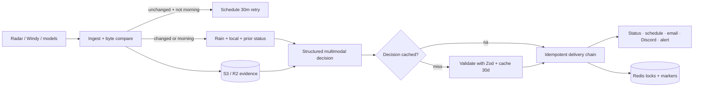
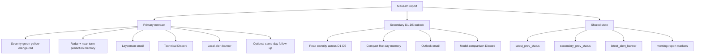
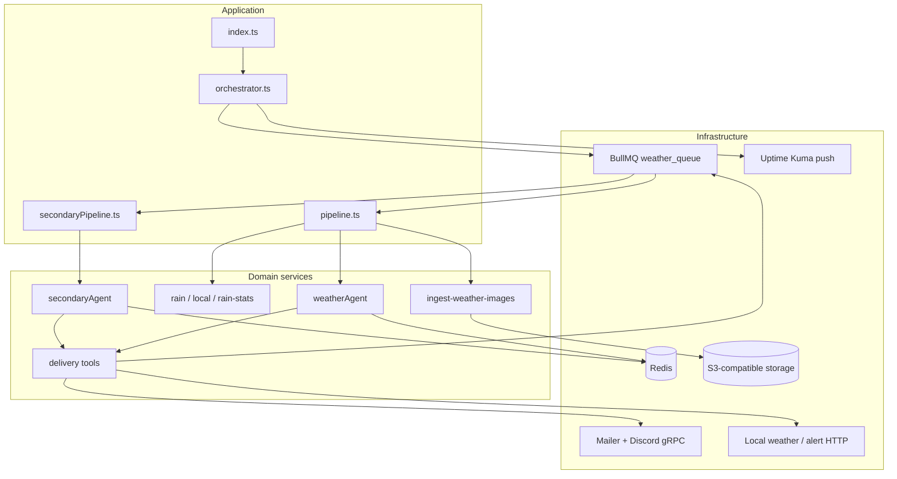

<div align="center">

# Mausam 3.0

**Weather updates for Mumbai that only fire when the evidence changes**

An automated nowcast and five-day outlook pipeline for Mumbai and the Mumbai Metropolitan Region. It ingests five configured primary evidence sources, produces Zod-validated severity decisions, and delivers email, Discord, and local alert reports through one Redis-backed BullMQ queue with three recurring schedules. A dated production record documents 392 reports over 63 monsoon days.

[](https://bun.sh)
[](https://www.typescriptlang.org/)
[](https://docs.bullmq.io/)
[](#observed-production-metrics)
[](#running-tests)
[](./LICENSE)

</div>

---

## Overview

Mausam 3.0 takes multi-source weather evidence for Mumbai MMR—IMD radar frames, rain-station observations, a local station feed, Windy accumulation screenshots, and GFS/ECMWF charts—and decides whether conditions have changed enough to justify a new report. The primary path has five configured image sources (two required radar feeds and three optional sources); the secondary path assembles ten forecast frames from two models across five horizons. When a report is required, a multimodal model returns a validated severity decision (green / yellow / orange / red) with layperson email HTML, a technical Discord message, and a short alert banner. The value is operational continuity: recipients get consistent updates when radar or context changes, not a flood of noise from every scheduled tick.

The service is a long-running [Bun](https://bun.sh/) process orchestrated by [BullMQ](https://docs.bullmq.io/) on Redis. Evidence is normalized with Sharp, optional Windy frames are captured with Puppeteer, structured decisions are produced through LangChain + Zod, and side effects (status persistence, follow-up scheduling, email, Discord, local alert) run under Redis-backed decision caching and per-action idempotency locks. There is no interactive web UI; delivery surfaces are email, Discord, a local alert HTTP endpoint, and Uptime Kuma push monitors.

> [!IMPORTANT]
> Mausam is an independent decision-support project. It is not an official warning service and must not replace guidance from the India Meteorological Department, civil authorities, or emergency services.

### Web app and WebMCP

The Astro app in `src/apps/web` renders the latest persisted nowcast and five-day outlook as a static Cloudflare site. In browsers that implement WebMCP, it progressively registers three read-only tools on `document.modelContext`: `get_weather_nowcast`, `get_weather_outlook`, and `get_forecast_reasoning`. Browsers without WebMCP continue to render the same interface without a polyfill.

For local testing, enable `chrome://flags/#enable-webmcp-testing`, relaunch Chrome, and start the app with `bun run dev` from `src/apps/web`. Registered tools can be inspected with Chrome's Model Context Tool Inspector or with `await document.modelContext.getTools()` in DevTools. No origin-trial token is committed to the repository.

## Features

| Area | What the project provides |
| --- | --- |
| **Primary nowcast** | Ingests five configured image sources: required PPI-Z and SRI radar plus optional Windy accumulation, short-range GFS, and ECMWF frames. It also queries two rain stations, scraped rain statistics, and one local-station endpoint before generating a structured near-term decision. |
| **Change-gated runs** | Compares the new image bytes with the latest stored object and uploads only on change. Unchanged evidence skips the AI call and schedules a 30-minute retry during active hours. Stable run IDs use a separate hash of mode and public image URLs. |
| **Morning guarantee** | Between 07:00 and 07:30 IST, the primary pipeline forces one report per Mumbai calendar date even if imagery is unchanged, tracked by a Redis morning-completion marker. |
| **Secondary D1–D5 outlook** | Daily transactional pipeline resolves complete GFS and ECMWF runs (five frames each at ~+24h through +120h), stages ten images under a run prefix, and only then analyzes and delivers. Incomplete sets are cleaned and aborted. |
| **Structured decisions** | Primary and secondary model outputs are Zod-validated. Free-form text never drives side effects; application code owns delivery order, recipients, and retries. |
| **Multi-channel delivery** | Primary order: save status → optional follow-up schedule → email → Discord → local alert. Secondary order: save status → email → Discord. Each action is locked and marked complete for 30 days. |
| **Mumbai scheduling** | Delayed follow-ups only fire same-day between 07:00 inclusive and 23:00 exclusive IST. Primary delayed jobs coalesce under a single deduplication ID so at most one follow-up stays pending. |
| **Severity-aware timing** | Follow-up delay windows are enforced by severity: red 2–3h, orange 3–6h, yellow 3–10h, green 8–12h (or null when no same-day update is useful). |
| **Evidence storage** | S3-compatible primary-source buckets retain the two latest JPEG frames per source and supply them to the model oldest-to-newest with capture times. Direct images are resized to 800×800 cover at JPEG quality 20; Windy screenshots use a 1280×720 viewport at quality 80. |
| **Health signals** | One Uptime Kuma heartbeat runs every minute, plus a successful-primary-run push URL. Direct image fetches time out at 30s; model URL probes at 15s; browser waits at 45s; model calls at 120s; gRPC calls at 15s; and monitoring/local HTTP calls at 10s. Rain-statistics HTTP fetches retry up to 3 attempts with a 30s request timeout and 1s delay. |

> [!NOTE]
> **Status as of the current codebase**
>
> - **Complete:** primary and secondary pipelines, image ingestion with optional-source tolerance, decision cache, delivery idempotency, BullMQ schedules, launchd plist, and a 47-test suite (`bun test`).
> - **Operational dependency:** email and Discord require external gRPC services (`MAILER_GRPC_ADDRESS`, `DISCORD_WEBHOOK_GRPC_ADDRESS`). Local weather/alert HTTP endpoints and rain-stats HTML are required at config validation time.
> - **Startup behavior:** `startOrchestrator()` currently **obliterates** `weather_queue` on every start, then reinstalls schedulers and enqueues a startup primary run. Delayed work that existed before restart is not preserved across process restarts.
> - **Station coverage:** rain context is built from two configured stations (Borivali, Kandivali East) plus scraped rain statistics; station failures are non-fatal and omitted from the prompt.

## Performance, scale & reliability

These are implementation-level bounds and local validation results. The repository does not contain a load-test harness or latency/throughput measurements, so no API p95, requests/second, cost-savings, or uptime claim is made.

| Dimension | Evidence-backed result |
| --- | --- |
| Primary ingestion | **5** configured image sources: **2 required** radar feeds and **3 optional** sources. |
| Secondary forecast set | **10** images per analyzed run: **2 models × 5 horizons** (+24h, +48h, +72h, +96h, +120h). A run is analyzed only after the complete set is staged; partial staging is cleaned up on error. |
| Queue topology | **1** Redis-backed BullMQ queue and **1** Worker instance; no explicit worker concurrency is configured. |
| Scheduling | **3** recurring BullMQ schedules: primary daily at 07:15 IST, secondary daily at 07:00 IST, and a minute heartbeat. |
| Failure recovery | Failed primary/secondary jobs request a **30-minute** retry when the active-hours guard permits it; optional image and station sources degrade independently while required radar failures abort the run. |
| Delivery safety | Primary runs can execute **5** ordered actions (status, optional schedule, email, Discord, alert); secondary runs execute **3** (status, email, Discord). Each action has a **10-minute** Redis lock and a **30-day** completion marker. |
| Decision reuse | Structured decisions are cached in Redis for **30 days**; retries can reuse the validated decision and skip actions already marked `done`. |
| Evidence retention | Primary ingestion keeps the **2 latest** objects per source; replacing an image uploads the new object before deleting older history. |
| Local validation | **47 passing / 0 failing** tests across **18 files**; latest `bun test --coverage` run reports **73.62% line** and **72.43% function** coverage. `bun run typecheck` passes. |

### Observed production metrics

This is a repository-recorded production snapshot from this host, covering **24 Jun 2026** through **25 Aug 2026**. The queue/status values were captured on **25 Aug 2026 at approximately 17:36 IST** and are historical, not a current live status. The source is the project’s operational record and the `539f89d` Git commit; no raw log export is checked in.

| Metric | Value |
| --- | --- |
| Days in production this monsoon | **63** (24 Jun – 25 Aug 2026) |
| Reports delivered | **392** (343 primary nowcasts · 49 secondary D1–D5 outlooks) |
| Emails sent | **390** to 2 recipients |
| Discord messages | **390** |
| Local alerts | **336** (primary only) |
| Follow-ups scheduled | **272** |
| Severity mix | yellow 297 (~76%) · orange 89 (~23%) · green 6 (~2%) · red 0 |
| Average cadence | **6.2 reports/day** (392 ÷ 63; 343 primary and 49 secondary) |
| Current process up since | 2026-08-21 11:17 IST (queue is obliterated on every start) |

| Runtime snapshot at capture time | Value |
| --- | --- |
| Queue counts at capture time | waiting 0 · active 0 · delayed 4 · completed 10 · failed 32 · schedulers 3 |
| Next primary at capture time | 2026-08-26 07:15 IST (`daily-weather-pipeline`) |
| Next secondary at capture time | 2026-08-26 07:00 IST (`daily-secondary-pipeline`) |
| Next delayed follow-up at capture time | 2026-08-25 21:18 IST (`delayed-weather-pipeline`, 4h delay) |
| Current primary alert | **yellow** — Borivali: light showers possible this evening |
| Current primary memory | Radar ~13:51 IST (stale); Borivali weak/patchy light echoes, no strong core; Mumbai–Thane scattered weak; 0–1h dry, 1–6h light showers |
| Current secondary peak | **yellow** — D1–D5 EC wetter than GFS across MMR/coast, confidence low–med |
| Alert banner | `Borivali: Light showers possible this evening` (yellow) |
| Morning markers | `2026-08-24` and `2026-08-25` both `done` |

## From input to result


```mermaid
flowchart LR
  SRC[Radar / Windy / models] --> ING[Ingest + byte compare]
  ING -->|unchanged + not morning| RETRY[Schedule 30m retry]
  ING -->|changed or morning| CTX[Rain + local + prior status]
  CTX --> AI[Structured multimodal decision]
  AI --> CACHE{Decision cached?}
  CACHE -->|miss| MODEL[Validate with Zod + cache 30d]
  CACHE -->|hit| DEL
  MODEL --> DEL[Idempotent delivery chain]
  DEL --> OUT[Status · schedule · email · Discord · alert]
  DEL --> REDIS[(Redis locks + markers)]
  ING --> S3[(S3 / R2 evidence)]
  S3 --> AI
```

Unchanged imagery short-circuits before the model is called, avoiding an unnecessary model invocation and notification cycle. When a run proceeds, the decision is keyed by a hash of mode, optional morning date key, and public image URLs. Retries reuse that decision and skip any delivery action already marked `done`. Active locks expire after ten minutes so a crashed worker cannot block a channel forever. Active-hours policy is applied only when scheduling delayed jobs—not when evaluating whether a current run may execute.

## Report domains


```mermaid
graph TD
  R[Mausam report]
  R --> N[Primary nowcast]
  R --> F[Secondary D1-D5 outlook]
  R --> S[Shared state]

  N --> N1[Severity green-yellow-orange-red]
  N --> N2[Radar + near-term prediction memory]
  N --> N3[Layperson email]
  N --> N4[Technical Discord]
  N --> N5[Local alert banner]
  N --> N6[Optional same-day follow-up]

  F --> F1[Peak severity across D1-D5]
  F --> F2[Compact five-day memory]
  F --> F3[Outlook email]
  F --> F4[Model-comparison Discord]

  S --> S1[latest_prev_status]
  S --> S2[secondary_prev_status]
  S --> S3[latest_alert_banner]
  S --> S4[morning-report markers]
```

## Architecture


```mermaid
flowchart TB
  subgraph App[Application]
    ENTRY[index.ts]
    ORCH[orchestrator.ts]
    PRIM[pipeline.ts]
    SEC[secondaryPipeline.ts]
  end

  subgraph Domain[Domain services]
    ING[ingest-weather-images]
    OBS[rain / local / rain-stats]
    PAGENT[weatherAgent]
    SAGENT[secondaryAgent]
    TOOLS[delivery tools]
  end

  subgraph Infra[Infrastructure]
    Q[BullMQ weather_queue]
    REDIS[(Redis)]
    S3[(S3-compatible storage)]
    GRPC[Mailer + Discord gRPC]
    HTTP[Local weather / alert HTTP]
    MON[Uptime Kuma push]
  end

  ENTRY --> ORCH
  ORCH --> Q
  Q --> PRIM
  Q --> SEC
  PRIM --> ING
  PRIM --> OBS
  PRIM --> PAGENT
  SEC --> SAGENT
  ING --> S3
  PAGENT --> REDIS
  SAGENT --> REDIS
  PAGENT --> TOOLS
  SAGENT --> TOOLS
  TOOLS --> GRPC
  TOOLS --> HTTP
  TOOLS --> Q
  ORCH --> MON
```

Architectural conventions that appear in the code:

- **No import-time workers:** `queue.ts` only constructs the BullMQ `Queue`. Workers, schedulers, and obliteration live in `orchestrator.ts`.
- **Model proposes, app disposes:** agents return Zod-validated objects; tools perform side effects in a fixed order under `runDeliveryOnce`.
- **Evidence-derived run IDs:** `createRunId` hashes namespace + image URLs (and morning discriminator for primary) so retries are stable.
- **Replace-then-delete storage:** `uploadWithLimit` uploads the new object first, then deletes previous keys only after success.
- **Required vs optional sources:** required radar failures fail the run; optional Windy/GFS/ECMWF failures log and continue with the latest stored object when available.
- **Mumbai time is explicit:** scheduling, morning windows, and report timestamps use `Asia/Kolkata` helpers rather than host-local time.

## Tech stack

| Layer | Technology |
| --- | --- |
| Runtime / language | [Bun](https://bun.sh/), TypeScript |
| Job orchestration | [BullMQ](https://docs.bullmq.io/) on Redis |
| AI / structured output | [LangChain](https://js.langchain.com/) (`@langchain/openai`), Zod |
| Models (configured) | `gpt-5.6-sol` (primary), `gpt-5.6-terra` (secondary) via OpenAI-compatible provider |
| Image processing | [Sharp](https://sharp.pixelplumbing.com/) |
| Browser capture | [Puppeteer](https://pptr.dev/) (Windy / model pages) |
| Object storage | AWS SDK S3 client against S3-compatible endpoints (e.g. Cloudflare R2) |
| Delivery RPC | gRPC (`@grpc/grpc-js`) — mailer + Discord webhook protos |
| HTTP clients | `fetch` / [Axios](https://axios-http.com/) where used; Cheerio for rain-stats HTML |
| Config validation | Zod-backed `src/config.ts` |
| Testing | `bun:test` (47 tests across 18 files; latest local coverage run: 73.62% lines, 72.43% functions) |
| Host process (macOS) | launchd plist in `launchd/` |

## Project structure

```text
.
├── index.ts                         # Entrypoint: starts the orchestrator
├── launchd/
│   └── com.mausam3.orchestrator.plist  # macOS KeepAlive service definition
├── src/
│   ├── config.ts                    # Required env validation
│   ├── pipeline.ts                  # Primary nowcast orchestration
│   ├── secondaryPipeline.ts         # Transactional D1–D5 orchestration
│   ├── ai/
│   │   ├── agents/                  # Prompts, models, primary/secondary agents
│   │   ├── decision-cache.ts        # Redis decision cache (30-day TTL)
│   │   ├── delivery-idempotency.ts  # Per-action locks + completion markers
│   │   └── tools/                   # Email, Discord, alert, status, schedule tools
│   ├── bull/
│   │   ├── queue.ts                 # Side-effect-free queue definitions
│   │   ├── orchestrator.ts          # Schedulers, worker, graceful shutdown
│   │   ├── scheduleJobs.ts          # Deduplicated delayed jobs
│   │   └── active-hours.ts          # 07:00–23:00 IST same-day policy
│   ├── data/                        # Radar, Windy, rain stations, local weather
│   ├── pipeline/helpers/            # Ingestion + saved-image assembly
│   ├── scrape/rainStats/            # Rain-statistics HTML scraper
│   ├── grpc/                        # Protos and mailer/Discord clients
│   └── storage/s3/                  # S3 client, upload, list, delete
├── .env.example                     # Configuration template
├── package.json
├── tsconfig.json
└── LICENSE                          # GNU AGPL v3 or later
```

Tests live beside the modules they exercise (e.g. `are-same.test.ts`, `delivery-idempotency.test.ts`).

## Requirements

- macOS or Linux host
- [Bun](https://bun.sh/) (project targets Bun APIs such as `Bun.redis`, `Bun.hash`, `Bun.file`)
- Redis reachable at `REDIS_HOST` / `REDIS_PORT` (defaults `127.0.0.1:6379`)
- S3-compatible object storage with buckets: `radar-ppi-z`, `radar-sri`, `satellite`, `gfs`, `ecmwf`, `model-images`
- OpenAI-compatible API key (`OPENAI_API_KEY`) for the configured LangChain models
- Chromium via Puppeteer’s managed browser (for Windy screenshots)
- Mailer gRPC service and Discord webhook gRPC service
- HTTP endpoints for local weather, local alert, rain-stats page, and Uptime Kuma push URLs
- Outbound network access to IMD radar, Windy, Tropical Tidbits, and rain APIs

The included launchd unit assumes Apple Silicon Homebrew Bun at `/opt/homebrew/bin/bun` and working directory `/Users/aneeshpatne/code/mausam3.0`. Adjust paths for other machines. There is no mobile app or simulator target; this is a headless server process.

## Getting started

1. **Clone and enter the repository**

```bash
git clone <repository-url> mausam3.0
cd mausam3.0
```

2. **Install dependencies**

```bash
bun install
```

3. **Configure environment**

```bash
cp .env.example .env
```

Fill every required value. Bun loads `.env` automatically.

| Variable | Purpose |
| --- | --- |
| `OPENAI_API_KEY` | Model provider credential |
| `ENDPOINT_URL` | S3-compatible API endpoint |
| `aws_access_key_id` / `aws_secret_access_key` | Object-storage credentials |
| `R2_PUBLIC_BASE_URL` | Public base URL for images readable by the model |
| `MAIL_RECIPIENTS` | Comma-separated email recipients |
| `LOCAL_WEATHER_URL` | Local-station JSON endpoint |
| `LOCAL_ALERT_URL` | Local alert controller endpoint |
| `RAIN_STATS_URL` | HTML page for the rain-statistics scraper |
| `UPTIME_KUMA_PUSH_URL` | Minute heartbeat push URL |
| `AI_JOB_PUSH_URL` | Successful primary-run push URL |
| `REDIS_HOST` / `REDIS_PORT` | Optional; default `127.0.0.1:6379` |
| `MAILER_GRPC_ADDRESS` | Optional; default `localhost:50055` |
| `DISCORD_WEBHOOK_GRPC_ADDRESS` | Optional; default `localhost:50051` |
| `DISCORD_CHANNEL_NAME` | Optional; default `weather` |

4. **Verify dependencies**

Ensure Redis, both gRPC services, and the S3 buckets exist and are reachable before starting.

5. **Start the service**

```bash
bun start
```

This validates config, obliterates and reinstalls `weather_queue` schedules, enqueues a startup primary run, and begins processing jobs.

6. **Optional: run under launchd**

Install `launchd/com.mausam3.orchestrator.plist` under `~/Library/LaunchAgents/` after editing paths, then load it with `launchctl`. Logs default to `/tmp/mausam3.orchestrator.out.log` and `/tmp/mausam3.orchestrator.err.log`.

> [!IMPORTANT]
> Replace every placeholder in `.env` before real operation. Do not commit real API keys, recipient lists, monitor tokens, or private endpoints. The launchd plist ships with local gRPC addresses suitable only for trusted local networking.

### Stop

Press `Ctrl-C` in the foreground process. The orchestrator closes the BullMQ worker and queue, gRPC clients, S3 client, and Redis client on `SIGTERM` / `SIGINT`.

## Running tests

Command-line (canonical for this repo):

```bash
bun test
```

Typecheck:

```bash
bun run typecheck
```

Coverage:

```bash
bun test --coverage
```

The suite covers model-run URL selection, Mumbai active hours, optional-source ingestion, saved-image assembly, decision caching, delivery idempotency, email sanitization, buffer equality, storage replacement ordering, and Puppeteer cleanup. The latest local runs report **47 pass, 0 fail** across 18 files; `bun test --coverage` reports **73.62% line** and **72.43% function** coverage, and `bun run typecheck` passes. Coverage is not produced by CI because this repository contains no CI workflow.

## Roadmap

- Soften or replace queue obliteration on startup so delayed follow-ups survive process restarts
- Harden secondary run acquisition against upstream timeouts (recent queue failures show secondary jobs timing out during model-image staging)
- Improve mailer gRPC resilience when the local mailer is slow or down (`DEADLINE_EXCEEDED` after 15s appears in failed delayed jobs)
- Expand rain-station coverage beyond the two currently configured IDs
- Consider perceptual image comparison if exact byte comparison ever proves too strict or too sensitive to encoding changes in production

## License

Mausam 3.0 is licensed under the **GNU Affero General Public License, version 3 or any later version** (`AGPL-3.0-or-later`). See [LICENSE](./LICENSE).

AGPL is a strong copyleft license. In practical terms, if you distribute a modified version, or run a modified version for users over a network, you must make the corresponding source available under the same license, subject to the full license text—especially section 13 for remote network interaction.

This README is a project description, not legal advice. The complete license terms control.

---

<div align="center">
  Built with Bun, BullMQ, LangChain, and a bias toward evidence that changed since the last report.
</div>
