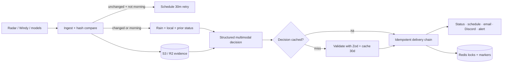
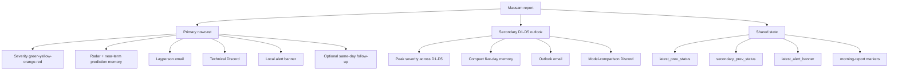
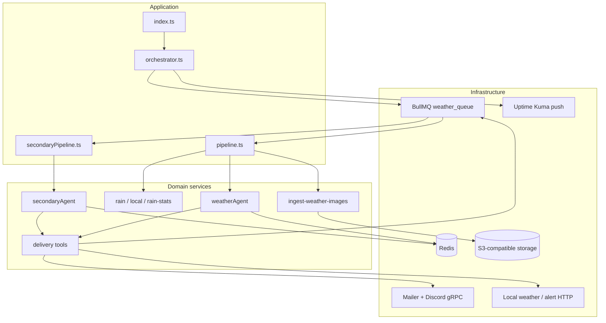

<div align="center">

# Mausam 3.0

**Weather updates for Mumbai that only fire when the evidence changes**

An automated nowcast and five-day outlook pipeline for Mumbai and the Mumbai Metropolitan Region. It ingests radar, rain, local-station, and model imagery, produces a structured severity decision, and delivers email, Discord, and local alert reports on a Mumbai-aware schedule.

[](https://bun.sh)
[](https://www.typescriptlang.org/)
[](https://docs.bullmq.io/)
[](#running-tests)
[](./LICENSE)

</div>

---

## Overview

Mausam 3.0 takes multi-source weather evidence for Mumbai MMR—IMD radar frames, rain-station observations, a local station feed, Windy accumulation screenshots, and GFS/ECMWF charts—and decides whether conditions have changed enough to justify a new report. When a report is required, a multimodal model returns a validated severity decision (green / yellow / orange / red) with layperson email HTML, a technical Discord message, and a short alert banner. The value is operational continuity: recipients get consistent updates when radar or context changes, not a flood of noise from every scheduled tick.

The service is a long-running [Bun](https://bun.sh/) process orchestrated by [BullMQ](https://docs.bullmq.io/) on Redis. Evidence is normalized with Sharp, optional Windy frames are captured with Puppeteer, structured decisions are produced through LangChain + Zod, and side effects (status persistence, follow-up scheduling, email, Discord, local alert) run under Redis-backed decision caching and per-action idempotency locks. There is no interactive web UI; delivery surfaces are email, Discord, a local alert HTTP endpoint, and Uptime Kuma push monitors.

> [!IMPORTANT]
> Mausam is an independent decision-support project. It is not an official warning service and must not replace guidance from the India Meteorological Department, civil authorities, or emergency services.

## Features

| Area | What the project provides |
| --- | --- |
| **Primary nowcast** | Ingests PPI-Z and SRI radar (required), plus optional Windy accumulation, short-range GFS, and ECMWF frames. Builds rain and local-station context, then generates a structured near-term decision for Mumbai MMR. |
| **Change-gated runs** | Uploads only when the new image hash differs from the latest stored object. Unchanged evidence skips the AI call and schedules a 30-minute retry during active hours. |
| **Morning guarantee** | Between 07:00 and 07:30 IST, the primary pipeline forces one report per Mumbai calendar date even if imagery is unchanged, tracked by a Redis morning-completion marker. |
| **Secondary D1–D5 outlook** | Daily transactional pipeline resolves complete GFS and ECMWF runs (five frames each at ~+24h through +120h), stages ten images under a run prefix, and only then analyzes and delivers. Incomplete sets are cleaned and aborted. |
| **Structured decisions** | Primary and secondary model outputs are Zod-validated. Free-form text never drives side effects; application code owns delivery order, recipients, and retries. |
| **Multi-channel delivery** | Primary order: save status → optional follow-up schedule → email → Discord → local alert. Secondary order: save status → email → Discord. Each action is locked and marked complete for 30 days. |
| **Mumbai scheduling** | Delayed follow-ups only fire same-day between 07:00 inclusive and 23:00 exclusive IST. Primary delayed jobs coalesce under a single deduplication ID so at most one follow-up stays pending. |
| **Severity-aware timing** | Follow-up delay windows are enforced by severity: red 2–3h, orange 3–6h, yellow 3–10h, green 8–12h (or null when no same-day update is useful). |
| **Evidence storage** | S3-compatible buckets hold the latest JPEG evidence per source. Direct images are resized to 800×800 cover at JPEG quality 20; Windy screenshots use a 1280×720 viewport at quality 80. |
| **Health signals** | Minute Uptime Kuma heartbeats plus a successful primary-run push URL. External I/O uses bounded timeouts (images 30s, model 120s, gRPC 15s, monitoring 10s). |

> [!NOTE]
> **Status as of the current codebase**
>
> - **Complete:** primary and secondary pipelines, image ingestion with optional-source tolerance, decision cache, delivery idempotency, BullMQ schedules, launchd plist, and a 46-test suite (`bun test`).
> - **Operational dependency:** email and Discord require external gRPC services (`MAILER_GRPC_ADDRESS`, `DISCORD_WEBHOOK_GRPC_ADDRESS`). Local weather/alert HTTP endpoints and rain-stats HTML are required at config validation time.
> - **Startup behavior:** `startOrchestrator()` currently **obliterates** `weather_queue` on every start, then reinstalls schedulers and enqueues a startup primary run. Delayed work that existed before restart is not preserved across process restarts.
> - **Station coverage:** rain context is built from two configured stations (Borivali, Kandivali East) plus scraped rain statistics; station failures are non-fatal and omitted from the prompt.

### Operational snapshot

Point-in-time values from the live Redis-backed `weather_queue` and status keys on this host (captured 2026-07-27 ~17:32 IST). These will change as the service runs.

| Metric | Value |
| --- | --- |
| Queue counts | waiting 0 · active 0 · delayed 4 · completed 10 · failed 50 · schedulers 3 |
| Next primary | 2026-07-28 07:15 IST (`daily-weather-pipeline`) |
| Next secondary | 2026-07-28 07:00 IST (`daily-secondary-pipeline`) |
| Next delayed follow-up | 2026-07-27 20:19 IST (`delayed-weather-pipeline`, 3h delay) |
| Current primary alert | **yellow** — intermittent showers possible this evening |
| Current primary memory | Radar ~16:47 IST; scattered weak–moderate Mumbai–Thane–Navi Mumbai–Panvel; iso stronger Raigad |
| Current secondary peak | **orange** — D1–D5 outlook with tentative Jul 30 peak disputed between GFS/ECMWF |
| Alert banner | `Intermittent showers possible this evening` (yellow) |
| Morning markers | `2026-07-26` and `2026-07-27` both `done` |
| Decision / delivery keys | ~87 cached decisions · ~386 delivery markers under `mausam:*` |
| Recent non-uptime failures | Secondary timeout (27 Jul 07:02); mailer gRPC `DEADLINE_EXCEEDED` on delayed primary runs (25–26 Jul) |

## From input to result


```mermaid
flowchart LR
  SRC[Radar / Windy / models] --> ING[Ingest + hash compare]
  ING -->|unchanged + not morning| RETRY[Schedule 30m retry]
  ING -->|changed or morning| CTX[Rain + local + prior status]
  CTX --> AI[Structured multimodal decision]
  AI --> CACHE{Decision cached?}
  CACHE -->|miss| MODEL[Validate with Zod + cache 30d]
  CACHE -->|hit| DEL
  MODEL --> DEL[Idempotent delivery chain]
  DEL --> OUT[Status · schedule · email · Discord · alert]
  DEL --> REDIS[(Redis locks + markers)]
  ING --> S3[(S3 / R2 evidence)]
  S3 --> AI
```

Unchanged imagery short-circuits before the model is called, which keeps API cost and noise low. When a run proceeds, the decision is keyed by a hash of mode, optional morning date key, and public image URLs. Retries reuse that decision and skip any delivery action already marked `done`. Active locks expire after ten minutes so a crashed worker cannot block a channel forever. Active-hours policy is applied only when scheduling delayed jobs—not when evaluating whether a current run may execute.

## Report domains


```mermaid
graph TD
  R[Mausam report]
  R --> N[Primary nowcast]
  R --> F[Secondary D1-D5 outlook]
  R --> S[Shared state]

  N --> N1[Severity green-yellow-orange-red]
  N --> N2[Radar + near-term prediction memory]
  N --> N3[Layperson email]
  N --> N4[Technical Discord]
  N --> N5[Local alert banner]
  N --> N6[Optional same-day follow-up]

  F --> F1[Peak severity across D1-D5]
  F --> F2[Compact five-day memory]
  F --> F3[Outlook email]
  F --> F4[Model-comparison Discord]

  S --> S1[latest_prev_status]
  S --> S2[secondary_prev_status]
  S --> S3[latest_alert_banner]
  S --> S4[morning-report markers]
```

## Architecture


```mermaid
flowchart TB
  subgraph App[Application]
    ENTRY[index.ts]
    ORCH[orchestrator.ts]
    PRIM[pipeline.ts]
    SEC[secondaryPipeline.ts]
  end

  subgraph Domain[Domain services]
    ING[ingest-weather-images]
    OBS[rain / local / rain-stats]
    PAGENT[weatherAgent]
    SAGENT[secondaryAgent]
    TOOLS[delivery tools]
  end

  subgraph Infra[Infrastructure]
    Q[BullMQ weather_queue]
    REDIS[(Redis)]
    S3[(S3-compatible storage)]
    GRPC[Mailer + Discord gRPC]
    HTTP[Local weather / alert HTTP]
    MON[Uptime Kuma push]
  end

  ENTRY --> ORCH
  ORCH --> Q
  Q --> PRIM
  Q --> SEC
  PRIM --> ING
  PRIM --> OBS
  PRIM --> PAGENT
  SEC --> SAGENT
  ING --> S3
  PAGENT --> REDIS
  SAGENT --> REDIS
  PAGENT --> TOOLS
  SAGENT --> TOOLS
  TOOLS --> GRPC
  TOOLS --> HTTP
  TOOLS --> Q
  ORCH --> MON
```

Architectural conventions that appear in the code:

- **No import-time workers:** `queue.ts` only constructs the BullMQ `Queue`. Workers, schedulers, and obliteration live in `orchestrator.ts`.
- **Model proposes, app disposes:** agents return Zod-validated objects; tools perform side effects in a fixed order under `runDeliveryOnce`.
- **Evidence-derived run IDs:** `createRunId` hashes namespace + image URLs (and morning discriminator for primary) so retries are stable.
- **Replace-then-delete storage:** `uploadWithLimit` uploads the new object first, then deletes previous keys only after success.
- **Required vs optional sources:** required radar failures fail the run; optional Windy/GFS/ECMWF failures log and continue with the latest stored object when available.
- **Mumbai time is explicit:** scheduling, morning windows, and report timestamps use `Asia/Kolkata` helpers rather than host-local time.

## Tech stack

| Layer | Technology |
| --- | --- |
| Runtime / language | [Bun](https://bun.sh/), TypeScript |
| Job orchestration | [BullMQ](https://docs.bullmq.io/) on Redis |
| AI / structured output | [LangChain](https://js.langchain.com/) (`@langchain/openai`), Zod |
| Models (configured) | `gpt-5.6-sol` (primary), `gpt-5.6-terra` (secondary) via OpenAI-compatible provider |
| Image processing | [Sharp](https://sharp.pixelplumbing.com/) |
| Browser capture | [Puppeteer](https://pptr.dev/) (Windy / model pages) |
| Object storage | AWS SDK S3 client against S3-compatible endpoints (e.g. Cloudflare R2) |
| Delivery RPC | gRPC (`@grpc/grpc-js`) — mailer + Discord webhook protos |
| HTTP clients | `fetch` / [Axios](https://axios-http.com/) where used; Cheerio for rain-stats HTML |
| Config validation | Zod-backed `src/config.ts` |
| Testing | `bun:test` (46 tests across 18 files) |
| Host process (macOS) | launchd plist in `launchd/` |

## Project structure

```text
.
├── index.ts                         # Entrypoint: starts the orchestrator
├── launchd/
│   └── com.mausam3.orchestrator.plist  # macOS KeepAlive service definition
├── src/
│   ├── config.ts                    # Required env validation
│   ├── pipeline.ts                  # Primary nowcast orchestration
│   ├── secondaryPipeline.ts         # Transactional D1–D5 orchestration
│   ├── ai/
│   │   ├── agents/                  # Prompts, models, primary/secondary agents
│   │   ├── decision-cache.ts        # Redis decision cache (30-day TTL)
│   │   ├── delivery-idempotency.ts  # Per-action locks + completion markers
│   │   └── tools/                   # Email, Discord, alert, status, schedule tools
│   ├── bull/
│   │   ├── queue.ts                 # Side-effect-free queue definitions
│   │   ├── orchestrator.ts          # Schedulers, worker, graceful shutdown
│   │   ├── scheduleJobs.ts          # Deduplicated delayed jobs
│   │   └── active-hours.ts          # 07:00–23:00 IST same-day policy
│   ├── data/                        # Radar, Windy, rain stations, local weather
│   ├── pipeline/helpers/            # Ingestion + saved-image assembly
│   ├── scrape/rainStats/            # Rain-statistics HTML scraper
│   ├── grpc/                        # Protos and mailer/Discord clients
│   └── storage/s3/                  # S3 client, upload, list, delete
├── .env.example                     # Configuration template
├── package.json
├── tsconfig.json
└── LICENSE                          # GNU AGPL v3 or later
```

Tests live beside the modules they exercise (e.g. `are-same.test.ts`, `delivery-idempotency.test.ts`).

## Requirements

- macOS or Linux host
- [Bun](https://bun.sh/) (project targets Bun APIs such as `Bun.redis`, `Bun.hash`, `Bun.file`)
- Redis reachable at `REDIS_HOST` / `REDIS_PORT` (defaults `127.0.0.1:6379`)
- S3-compatible object storage with buckets: `radar-ppi-z`, `radar-sri`, `satellite`, `gfs`, `ecmwf`, `model-images`
- OpenAI-compatible API key (`OPENAI_API_KEY`) for the configured LangChain models
- Chromium via Puppeteer’s managed browser (for Windy screenshots)
- Mailer gRPC service and Discord webhook gRPC service
- HTTP endpoints for local weather, local alert, rain-stats page, and Uptime Kuma push URLs
- Outbound network access to IMD radar, Windy, Tropical Tidbits, and rain APIs

The included launchd unit assumes Apple Silicon Homebrew Bun at `/opt/homebrew/bin/bun` and working directory `/Users/aneeshpatne/code/mausam3.0`. Adjust paths for other machines. There is no mobile app or simulator target; this is a headless server process.

## Getting started

1. **Clone and enter the repository**

```bash
git clone <repository-url> mausam3.0
cd mausam3.0
```

2. **Install dependencies**

```bash
bun install
```

3. **Configure environment**

```bash
cp .env.example .env
```

Fill every required value. Bun loads `.env` automatically.

| Variable | Purpose |
| --- | --- |
| `OPENAI_API_KEY` | Model provider credential |
| `ENDPOINT_URL` | S3-compatible API endpoint |
| `aws_access_key_id` / `aws_secret_access_key` | Object-storage credentials |
| `R2_PUBLIC_BASE_URL` | Public base URL for images readable by the model |
| `MAIL_RECIPIENTS` | Comma-separated email recipients |
| `LOCAL_WEATHER_URL` | Local-station JSON endpoint |
| `LOCAL_ALERT_URL` | Local alert controller endpoint |
| `RAIN_STATS_URL` | HTML page for the rain-statistics scraper |
| `UPTIME_KUMA_PUSH_URL` | Minute heartbeat push URL |
| `AI_JOB_PUSH_URL` | Successful primary-run push URL |
| `REDIS_HOST` / `REDIS_PORT` | Optional; default `127.0.0.1:6379` |
| `MAILER_GRPC_ADDRESS` | Optional; default `localhost:50055` |
| `DISCORD_WEBHOOK_GRPC_ADDRESS` | Optional; default `localhost:50051` |
| `DISCORD_CHANNEL_NAME` | Optional; default `weather` |

4. **Verify dependencies**

Ensure Redis, both gRPC services, and the S3 buckets exist and are reachable before starting.

5. **Start the service**

```bash
bun start
```

This validates config, obliterates and reinstalls `weather_queue` schedules, enqueues a startup primary run, and begins processing jobs.

6. **Optional: run under launchd**

Install `launchd/com.mausam3.orchestrator.plist` under `~/Library/LaunchAgents/` after editing paths, then load it with `launchctl`. Logs default to `/tmp/mausam3.orchestrator.out.log` and `/tmp/mausam3.orchestrator.err.log`.

> [!IMPORTANT]
> Replace every placeholder in `.env` before real operation. Do not commit real API keys, recipient lists, monitor tokens, or private endpoints. The launchd plist ships with local gRPC addresses suitable only for trusted local networking.

### Stop

Press `Ctrl-C` in the foreground process. The orchestrator closes the BullMQ worker and queue, gRPC clients, S3 client, and Redis client on `SIGTERM` / `SIGINT`.

## Running tests

Command-line (canonical for this repo):

```bash
bun test
```

Typecheck:

```bash
bun run typecheck
```

Coverage:

```bash
bun test --coverage
```

The suite covers model-run URL selection, Mumbai active hours, optional-source ingestion, saved-image assembly, decision caching, delivery idempotency, email sanitization, buffer equality, storage replacement ordering, and Puppeteer cleanup. As of the last local run: **46 pass, 0 fail** across 18 files.

## Roadmap

- Soften or replace queue obliteration on startup so delayed follow-ups survive process restarts
- Harden secondary run acquisition against upstream timeouts (recent queue failures show secondary jobs timing out during model-image staging)
- Improve mailer gRPC resilience when the local mailer is slow or down (`DEADLINE_EXCEEDED` after 15s appears in failed delayed jobs)
- Expand rain-station coverage beyond the two currently configured IDs
- Consider non-hash change detection if hash-identical JPEG noise ever proves too strict or too loose in production

## License

Mausam 3.0 is licensed under the **GNU Affero General Public License, version 3 or any later version** (`AGPL-3.0-or-later`). See [LICENSE](./LICENSE).

AGPL is a strong copyleft license. In practical terms, if you distribute a modified version, or run a modified version for users over a network, you must make the corresponding source available under the same license, subject to the full license text—especially section 13 for remote network interaction.

This README is a project description, not legal advice. The complete license terms control.

---

<div align="center">
  Built with Bun, BullMQ, LangChain, and a bias toward evidence that changed since the last report.
</div>
